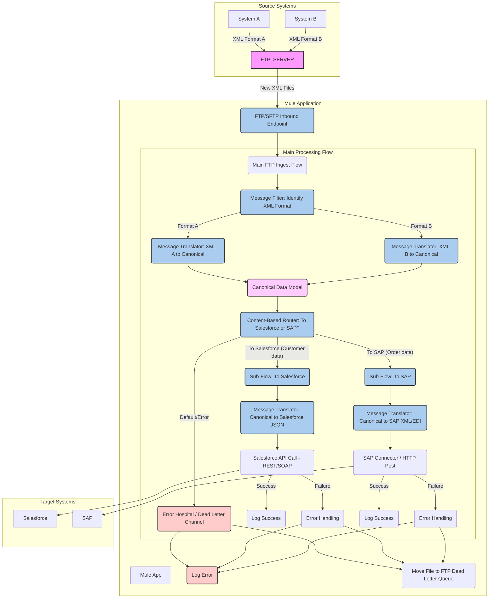

```mermaid
graph TD
    subgraph Source Systems
        SYS1[System A] -- XML Format A --> FTP_SERVER
        SYS2[System B] -- XML Format B --> FTP_SERVER
    end

    subgraph Mule Application

        MULE_APP[Mule App]
        FTP_SERVER --> |New XML Files| PollingConsumer
        PollingConsumer(FTP/SFTP Inbound Endpoint) --> MainFlow

        subgraph Main Processing Flow
            MainFlow(Main FTP Ingest Flow) --> FileFilter(Message Filter: Identify XML Format)

            FileFilter -- Format A --> TransformA(Message Translator: XML-A to Canonical)
            FileFilter -- Format B --> TransformB(Message Translator: XML-B to Canonical)

            TransformA --> CanonicalDataModel
            TransformB --> CanonicalDataModel(Canonical Data Model)

            CanonicalDataModel --> Router(Content-Based Router: To Salesforce or SAP?)

            Router -- To Salesforce (Customer data) --> SalesforceSubFlow
            Router -- To SAP (Order data) --> SAPSubFlow

            Router -- Default/Error --> ErrorHandler(Error Hospital / Dead Letter Channel)

            SalesforceSubFlow(Sub-Flow: To Salesforce) --> TransformSF(Message Translator: Canonical to Salesforce JSON)
            TransformSF --> SalesforceAPI(Salesforce API Call - REST/SOAP)
            SalesforceAPI -- Success --> LogSFSuccess(Log Success)
            SalesforceAPI -- Failure --> ErrorHandlerSF(Error Handling)

            SAPSubFlow(Sub-Flow: To SAP) --> TransformSAP(Message Translator: Canonical to SAP XML/EDI)
            TransformSAP --> SAP_Connector(SAP Connector / HTTP Post)
            SAP_Connector -- Success --> LogSAPSuccess(Log Success)
            SAP_Connector -- Failure --> ErrorHandlerSAP(Error Handling)
        end

        ErrorHandler --> ErrorLog(Log Error)
        ErrorHandler --> MoveToDLQ(Move File to FTP Dead Letter Queue)

        ErrorHandlerSF --> ErrorLog(Log Error)
        ErrorHandlerSF --> MoveToDLQ
        ErrorHandlerSAP --> ErrorLog(Log Error)
        ErrorHandlerSAP --> MoveToDLQ
    end

    subgraph Target Systems
        SalesforceAPI --> SF[Salesforce]
        SAP_Connector --> SAP[SAP]
    end

    style FTP_SERVER fill:#f9f,stroke:#333,stroke-width:2px
    style PollingConsumer fill:#ace,stroke:#333,stroke-width:2px
    style FileFilter fill:#ace,stroke:#333,stroke-width:2px
    style TransformA fill:#ace,stroke:#333,stroke-width:2px
    style TransformB fill:#ace,stroke:#333,stroke-width:2px
    style CanonicalDataModel fill:#fcf,stroke:#333,stroke-width:2px
    style Router fill:#ace,stroke:#333,stroke-width:2px
    style SalesforceSubFlow fill:#ace,stroke:#333,stroke-width:2px
    style SAPSubFlow fill:#ace,stroke:#333,stroke-width:2px
    style TransformSF fill:#ace,stroke:#333,stroke-width:2px
    style TransformSAP fill:#ace,stroke:#333,stroke-width:2px
    style ErrorHandler fill:#fcc,stroke:#333,stroke-width:2px
    style ErrorLog fill:#fcc,stroke:#333,stroke-width:2px
```
    style MoveToDLQ fill:#fcc,stroke:#333,stroke-width:2px
    style ErrorHandlerSF fill:#fcc,stroke:#333,stroke-width:2px
    style ErrorHandlerSAP fill:#fcc,stroke:#333,stroke-width:2px
